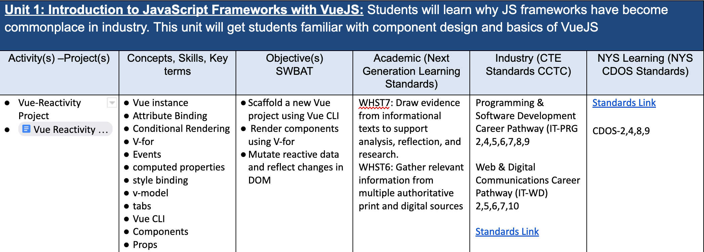
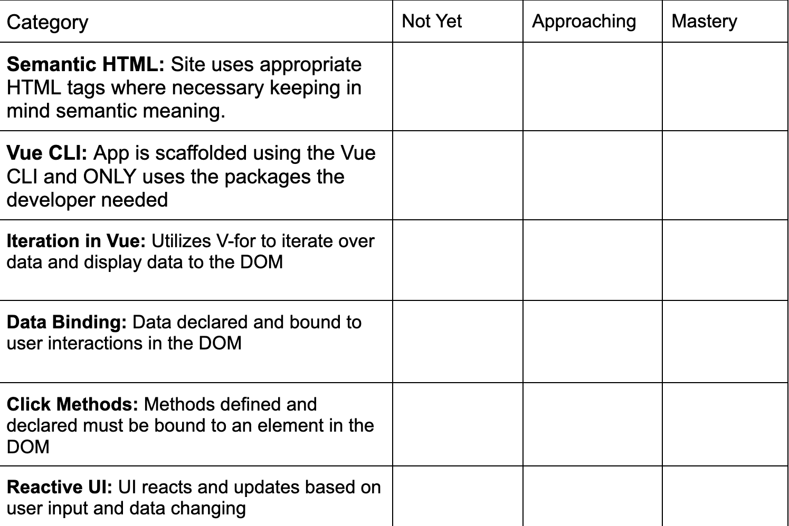

Project Based Learning (PBL) requires designing projects that teach the skills that encompass a unit. In this article we'll be breaking down one of my units and projects from the second half of my intro class. It's important to note that this is NOT project based assesment. This is Project Based **Learning**. While we do use the project as an assesment tool, the project itself is the guiding force for instruction. Often times PBL gets confused as an assesment tool at the end of a unit rather than **being** the unit. 

## Unit Design

---  

The above screenshot shows my first unit of term 2. An introduction to JavaScript frameworks with VueJS. I begin every unit by identifying the skills I want students to learn during that unit. 

Once the key skills have been identified we can begin to design a project that encompasses those skills for the unit. For this unit I created the "Vue Reactivity Project". The project asks students to develop an application that changes the user interface based on input by the user. It's key to have demo project that meets the criteria to show the students. In this scenario I show a pizza builder app I made that changes the image of the pizza based on the ingredients clicked. 

## Starting the Unit

While I use both PBL and self-paced learning strategies, I still begin units much like every other teacher. PBL and self-paced learning are not mutually exclusive with teacher directed lessons. In this unit we beguin by discussing the pain points of previous projects in JavaScript and introducing how frameworks like VueJS alleviate those issues. I demo some code written in Vue and compare/contrast that code with vanilla JavaScript code. This demo shows **why** we are learning this framework while also building motivation from students as they often find a lot of the Vue syntax/methods more appealing than vanilla JavaScript. 

Now that I've answered the **why** of the unit with the class we can move onto introducing their project. I give them the rubric and go over the demo project and how the rubric's skills are present in the demo project. 

---

The above rubric is cut off but you can see some of the skills being assessed. Each skill is identified in the rubric and again in the demo to help students make those connections. 

## Next Steps

Once the students have an idea of what skills they should be learning and their project goal, it's time to let go of the reins. At this point they have the option to brainstorm project ideas or beging watching my videos explaining the skills. Each video is between 3-7 minutes long and details one skill. As the students begin brainstorming or exploring the skill, I begin talking with students 1 on 1 and helping them develop a project idea that meets the rubric. 

Over the course of the next week or so I'll continue to answer questions, conferenc with students, and identify shared concerns/misconceptions. If