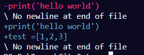

## Reviewing Our Commits

Let's begin by making changes in test.py. I'm going to create an array/list called test with values [1,2,3] and save. Using the command "git diff" we review what has changed in our file. 



Let's commit this code and try to undo the changes/view our old files afterwards. Now that we've committed and we find that we have a bug or are confused on changes from the previous file. We need to see what the file was like from earlier!

## Git Log and Git Checkout

We can use either git log or gitlog --oneline to view our history of commits. Log displays the history in the terminal while --oneline creates a simplified view for us to read more comfortably. Let's use oneline to view the file.
```git
git log --oneline
```
We should see something like the following


We can now use Git to "checkout" a previous commit using the key next to our previous commit. 
```git
git checkout 75d7b3e
```
You'll notice that we are in a "detached head state". Essentially any changes we make here won't be saved in this "branch" or timeline. We can create a new branch but I want to save that for a seperate article. We can also see that our test.py file no longer has the list created earlier. Let's get back to the present timeline with (Note your master branch could be called "main")
```git
git checkout master
```

## Reverting to an Older Commit

If we realized we added a file to the staging area that should not be there or we do not want committed we can do
```git 
git reset filename
```
OR the following to clear the staging area.
```git
git reset .
```
Finally to revert to a previous commit (essentially deleting our current commit) we can use 
```git
git reset --hard HEAD
```
Let's test that now. I now see the changes have been reverted to the previous commit. Finally let's push this to origin with a different command due to the fact that this commit will conflict with yesterday's changes

```git
git push -f
```
There's more to reverting commits and pushing but for now we have the basics down. 

## Using the GUI
Github desktop makes the above processes a little easier. Let's change test.py to include that list again and then go the GUI. The GUI clearly shows us what has been changed. We can simply right click the files to ignore those changes. 

## Reverting in the GUI
In the GUI we can click history and view the previous changes. Let's right click on the last commit and click "revert". If we go back to our file ypu'll notice our changes are no longer there! This process is my favorite aspect of the GUI. In the next article we'll explore Git Branches and mergers. 